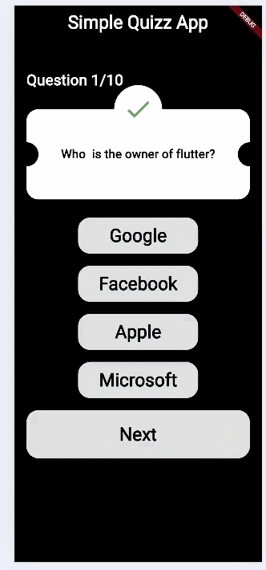

# Simple Quiz App (Cubit) 🧠

A simple and clean Quiz application built with **Flutter** and **Cubit** state management. 
The app presents 10 multiple-choice questions about mobile app development, allows the user to select one answer per question, calculates the final score, and displays a result dialog (Pass/Fail) with the option to restart.

---

## 📸 Preview



---

## ✨ Features

- ✅ 10 multiple-choice questions (Single Choice).
- ✅ Clean and modern dark UI.
- ✅ Option buttons change color to orange when selected.
- ✅ "Next" button appears for questions 1–9.
- ✅ "Submit" button appears on the last question (10).
- ✅ Automatic score calculation.
- ✅ Result dialog:
  - **Passed** (Green) if score ≥ 5.
  - **Failed** (Red) if score < 5.
- ✅ **Restart** button to reset the quiz and start again.
- ✅ State management using **Cubit (from flutter_bloc)**.
- ✅ Clean architecture folder structure.

---

## 🛠️ Technologies Used

- **Flutter** – UI Toolkit.
- **Dart** – Programming Language.
- **flutter_bloc** – State Management.
- **Cubit Pattern** – Lightweight state management.

---

## 📂 Project Structure

```text
lib/
├── core/
│   └── constant/
│       └── app_color.dart
│
├── cubit/
│   ├── quizz_cubit.dart
│   └── quizz_state.dart
│
├── features/
│   └── quizz/
│       ├── data/
│       │   └── question_data.dart
│       ├── models/
│       │   └── question_model.dart
│       └── ui/
│           ├── views/
│           │   └── home_view.dart
│           └── widgets/
│               ├── button_widget.dart
│               ├── dialog_widget.dart
│               ├── question_widget.dart
│               └── text_widget.dart
│
└── main.dart

🧩 How It Works (Cubit Flow)
resetQuizz() → Loads the first question.
selectedAnswer(index) → Saves the selected answer.
nextQuestion() → Moves to the next question.
submitQuizz() → Calculates the score and shows the result.

👨‍💻 Author
Jafar Maksoud
Email: jafarmaksoud8@gmail.com
